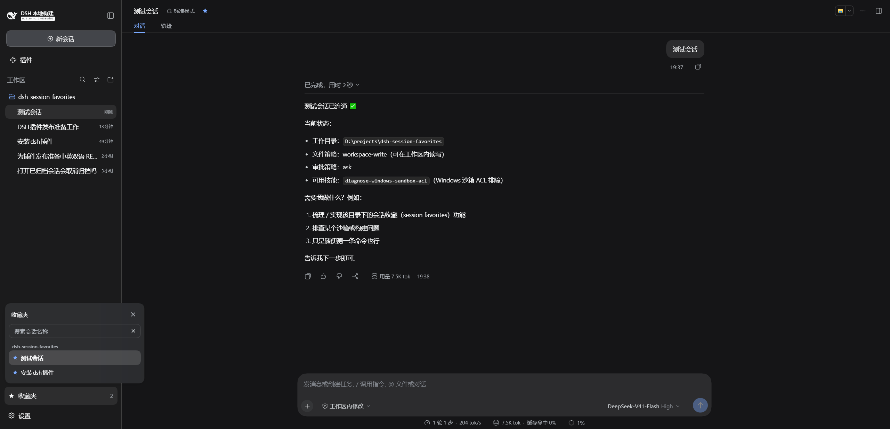

<div align="center">

  # DSH Session Favorites

  **Keep the conversations you return to, one click away**

  [简体中文](README.zh-CN.md) · [MIT](LICENSE)

  [](LICENSE)
  [](https://www.npmjs.com/package/dsh-session-favorites)
  [](https://www.npmjs.com/package/dsh-session-favorites)
  [](https://github.com/hiuga0321/dsh-session-favorites)
  [](#prerequisites)
</div>

> DSH Session Favorites is a community-maintained DeepSeek Harness (DSH) plugin, not an official DeepSeek AI product.

## What you can do

Star the conversations you keep coming back to, then find them without scrolling the sidebar.

- **Save a conversation**: star it from the session header, or add it from the favorites list.
- **Browse by workspace**: favorites are grouped by the workspace they belong to, so long lists stay readable.
- **Find one fast**: search titles from the top of the list.
- **Bring one into the prompt**: type `@` in the composer to insert a favorited session.
- **Keep names current**: rename a favorite and the real conversation is renamed too, through DSH's own rename path.
- **See the same list everywhere**: favorites are stored on the host, so every tab and browser sharing a profile agrees.
- **Reach archived favorites**: an archived favorite still opens, without changing its archived state.
- **Clear out dead entries**: deleted conversations are marked and can be cleaned up in one confirmed step.

## Screenshots

Open **Favorites** at the bottom of the sidebar, above the settings button:



Each favorite carries a star, and the sidebar entry shows how many favorites the current profile holds. Rows are grouped under the workspace they belong to and rename/remove actions appear on hover.

## Prerequisites

- A working [DeepSeek Harness](https://github.com/deepseek-ai/deepseek-harness) Web installation with `dsh` available in your terminal.
- Supported DSH versions: `0.1.5-rc.2` through `0.2.1-alpha.1`.
- Node.js `>=22.15`.

## Installation

Examples use the `web` profile. Replace it with the profile you actually use.

### Ask an agent to install it

Send this prompt to an agent that can run terminal commands on your computer:

```text
Install the latest dsh-session-favorites into my local DSH web profile using the official npm registry. Check the plugin configuration afterward, then explain how to reload DSH and open the favorites list.
```

### Install manually

Run in PowerShell:

```powershell
[Console]::OutputEncoding = [System.Text.Encoding]::UTF8
$OutputEncoding = [System.Text.Encoding]::UTF8

dsh plugin --profile web add dsh-session-favorites@latest --registry=https://registry.npmjs.org/
```

Restart DSH Web, then hard-refresh your browser with `Ctrl+Shift+R`. The **Favorites** entry appears at the bottom of the sidebar.

## Usage

| Goal | Action |
| --- | --- |
| Favorite the current conversation | Click the star in the session header |
| Open your favorites | Sidebar footer → **Favorites** |
| Find a favorite | Type in the search box at the top of the list |
| Open a favorite | Click its row |
| Insert a favorite into a prompt | In the composer, type `@` and pick a session |
| Rename a favorite | Hover the row → rename; the real conversation is renamed too |
| Remove one favorite | Hover the row → remove → confirm |
| Clean up deleted conversations | Use the banner shown next to the list, then confirm |

The panel closes only through its close button, so clicking elsewhere will not dismiss it mid-task. Removing a favorite always asks for confirmation, and bulk cleanup uses the same dialog.

Favorites are stored in a `favorites` storage domain on the host. DSH's own session data is never modified, and nothing is written outside your DSH profile.

### Archived conversations

An archived favorite stays clickable, and **opening it does not change its archived state**. The plugin deliberately does not call DSH's unarchive API, so after you open one it is still archived — you can just read it. To actually unarchive it, use DSH's native **Unarchive**; the two operations are independent. If the small compatibility patch this relies on cannot be applied, the plugin reports it rather than failing silently, and opening an archived favorite degrades to a visible message.

### Renaming

Renaming a favorite renames the underlying conversation through DSH's own `session.rename`, the same path the native sidebar uses. If that rename succeeds but syncing the plugin's stored copy fails, the conversation keeps its new name and the plugin only logs a warning — your rename is never rolled back.

## Updates

To move to a newer release, rerun the installation command with the version you want, then restart DSH Web and hard-refresh the browser:

```powershell
dsh plugin --profile web add dsh-session-favorites@latest --registry=https://registry.npmjs.org/
```

## FAQ

### Why is the entry missing after installation?

Restart DSH Web and hard-refresh your browser, and make sure you installed into the profile you are actually using. If the entry is still missing, confirm the plugin resolved:

```powershell
dsh --profile web --dump-config
```

The output should include `session-favorites`, and the plugin package must declare both `dsh.bundle.patch` and `dsh.client.platform: "web"` — a package with only `dsh.client` installs as a plain dependency and shows no UI.

### Do favorites survive uninstalling the plugin?

They persist in your DSH profile. Reinstalling the plugin brings the list back. Uninstalling does not delete conversations or messages.

### Are favorites shared between my devices?

They are stored in your DSH profile on the host, so every tab and browser using that profile sees the same list. Separate DSH installations keep separate lists.

### Can I use it alongside other sidebar plugins?

Yes. The plugin only adds a footer entry, a header star, and an `@` source. It does not modify DSH's source or take over any other plugin's UI.

If something else goes wrong, open an [issue](https://github.com/hiuga0321/dsh-session-favorites/issues) with your DSH and plugin versions, reproduction steps, and error details.

## Install from source

<details>
<summary>Expand for development or testing unreleased changes</summary>

There is no build step: [`src`](src) is what ships, so the checkout runs as-is.

```powershell
[Console]::OutputEncoding = [System.Text.Encoding]::UTF8
$OutputEncoding = [System.Text.Encoding]::UTF8

git clone https://github.com/hiuga0321/dsh-session-favorites.git
Set-Location .\dsh-session-favorites
dsh plugin --profile web add .
```

Restart DSH Web and hard-refresh your browser afterward.

Checks before publishing:

```sh
node scripts/smoke.mjs                    # package identity, client load, key interaction paths
node --test test/schema.test.mjs          # storage-domain record schema
node --test test/favorites-core.test.mjs  # favorites CRUD logic
node --test test/client.test.mjs          # client contracts across DSH versions
```

`scripts/smoke.mjs` enforces that four declarations agree — [`src/package-identity.js`](src/package-identity.js), `package.json`'s `name`, `cordis.patch.yml`'s `name`, and the client bundle's `id`. Renaming the package and missing one of them fails here.

`devDependencies` are pinned to `0.1.5-rc.2`, the compatibility floor and the baseline for host/remote contract verification. To run a real version matrix, install each version separately and run the checks above against each — fixtures for both client contract shapes are already in place.

</details>

## License

Licensed under the [MIT License](LICENSE).
